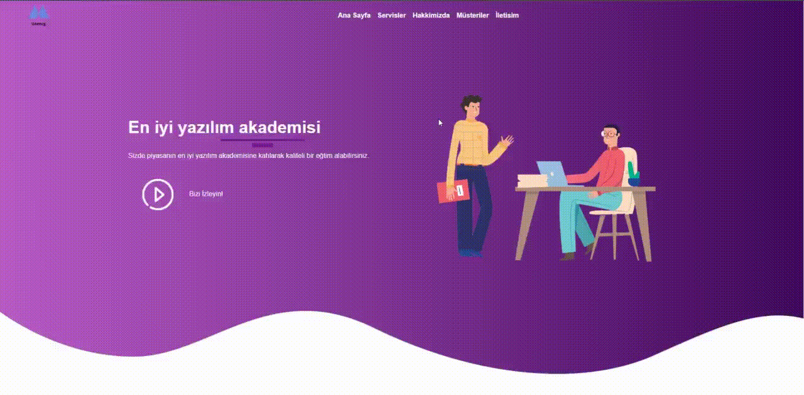

<h1> Udemig Education <h1>

This project is an educational website developed using Bootstrap.

<h2> Features <h2>

<ul>

<li> Advanced Interface: A modern and user-friendly interface created with the features provided by Bootstrap. <li>

<li> Fully Responsive: A fully responsive design that works smoothly on different devices (computer, tablet, mobile).    <li>

<li> Easy to Use: It is possible to easily navigate and use the site thanks to its user-friendly interface. <li>

<li> Educational Content: A wide range of content to meet the needs of users with rich educational content and resources. <li>

<ul>

<h2> Preview: <h2>

